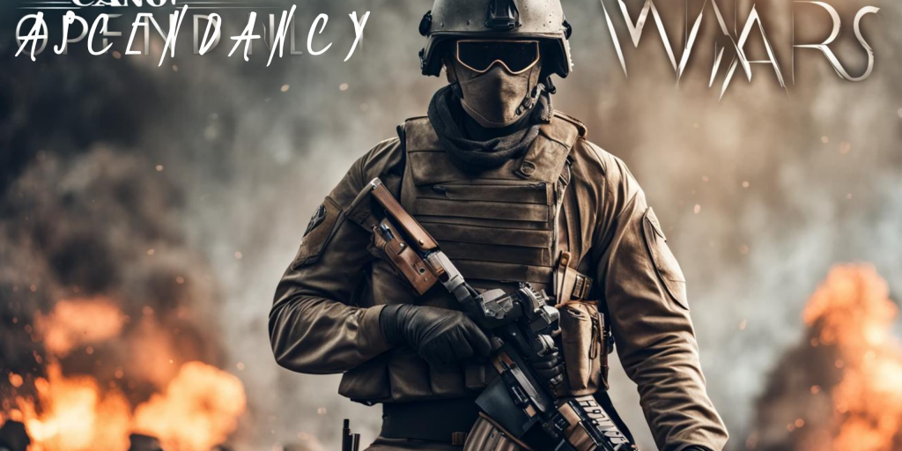

# AWSPDocs
> [!IMPORTANT]
> This mission is still in alpha stages and in active development, the final result won't be the same as what you see currently. Main tree is the most stable one. If you wanted to help with the mission, consider take a look at Alpha tree. Ignore Development tree as it is being updated almost everyday. Development tree is only for anyone who is wondering what's being done to the mission everyday.

This is the documentation for Arma 3 mission Ascendancy Wars Single Player

## Changelog
  
  

### Features

* Choose whether to recruit local population, or recruit army from your HQ

* Zoning And Garrisoning System (ZAGS)  
  ZAGS is the core feature of Ascendancy Wars, creating dynamic zones across the map for players to capture and conquer.
  By default, these zones are under the control of the enemy commander, adding an element of challenge and strategy. 
  Prepare for a fierce counter-attack from the enemy commander upon capturing their zone, as they won't remain idle. 
  Each zone will be garrisoned with varying numbers of troops, which depend on available resources rather than a uniform distribution. 
  To optimize game performance and memory usage, garrisoned troops will only spawn when players or opposing enemies approach the zone, ensuring a seamless and immersive experience.
  
* Conflict Dynamics and Adversarial Response System  
  CDARS is an innovative system that revolutionizes the way player actions impact the enemy's perception and behavior.  
  This dynamic system tracks and manages player bounties, reflecting the level of animosity the enemy holds towards  
  the player based on a wide range of actions such as attacking outposts, military bases, and airports, capturing prisoners,  
  eliminating high-ranking officers, and even accounting for inaction. The system goes beyond mere numerical values,  
  offering a comprehensive view of the enemy's reaction and actions over time. With CDARS, players can experience a truly  
  immersive and responsive battlefield, where their choices and achievements shape the enemy's behavior and ultimately  
  determine the outcome of the mission

